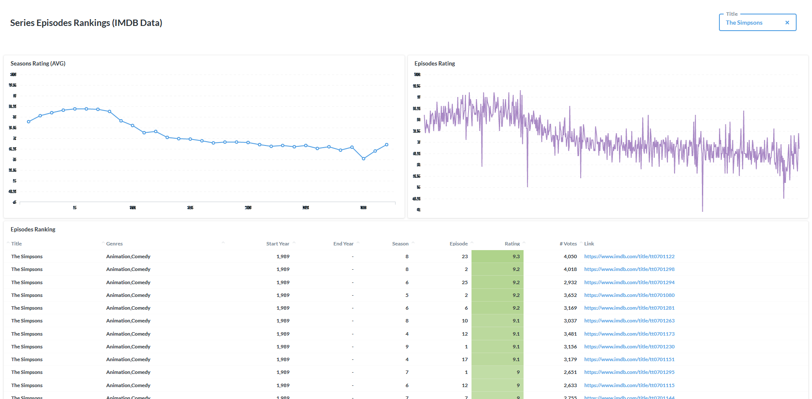

### Movies and Series
Find the top-rated Movies and Series using **[this interactive dashboard](http://metabase.intellimenta.com/public/dashboard/eae564a4-d9a3-46b1-9cd4-1f95ab5b1b18)**.

### Seasonsa and Episodes of a Series
Find different types of about a series using **[this interactive dashboard](http://metabase.intellimenta.com/public/dashboard/bb812d83-7cef-404e-8e14-87e1552cbe7c)**.

## FAQ
- **IMDB website has pages for rankings of movies and series based on their ratings, what is the advantage of using your dashboards?**  
The rankings on the IMDB website are limited, for example you cannot limit the results to certain years, or set a threshold for the minimum number of votes (for the rating), etc.  
Also there is no ranking on IMDB website similar to our Episodes dashboard.
