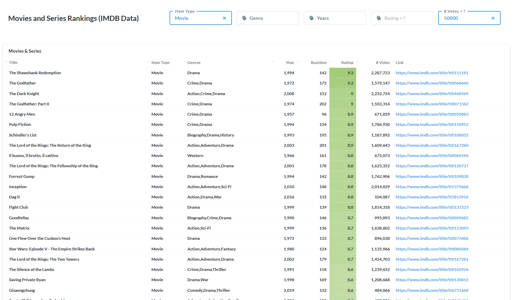

Find the highest rated movies and episodes using the following interactive dashboards.

### Movies and Series
- Find the highest-rated Movies and Series using [this](http://metabase.intellimenta.com/public/dashboard/eae564a4-d9a3-46b1-9cd4-1f95ab5b1b18) interactive dashboard.
- Ability to filter by genre, year, minimu rating and minimum number of votes.

### Series' Episodes
- Find the highest-rated episodes for any series using [this](http://metabase.intellimenta.com/public/dashboard/bb812d83-7cef-404e-8e14-87e1552cbe7c) interactive dashboard.
- This is most useful for series that have independent episode structure (i.e. each episode can be watched without knowledge of previous episodes), e.x. The Simpsons, Seinfeld, Bob's Burger, ...

## FAQ
- **IMDB website has pages for rankings of movies and series based on their ratings, what is the advantage of using your dashboards?**  
The rankings on the IMDB website are limited, for example you cannot limit the results to certain years, or set a threshold for the minimum number of votes (for the rating), etc.  
BTW there is no similar ranking for our Episodes dashboard, on IMDB website.
